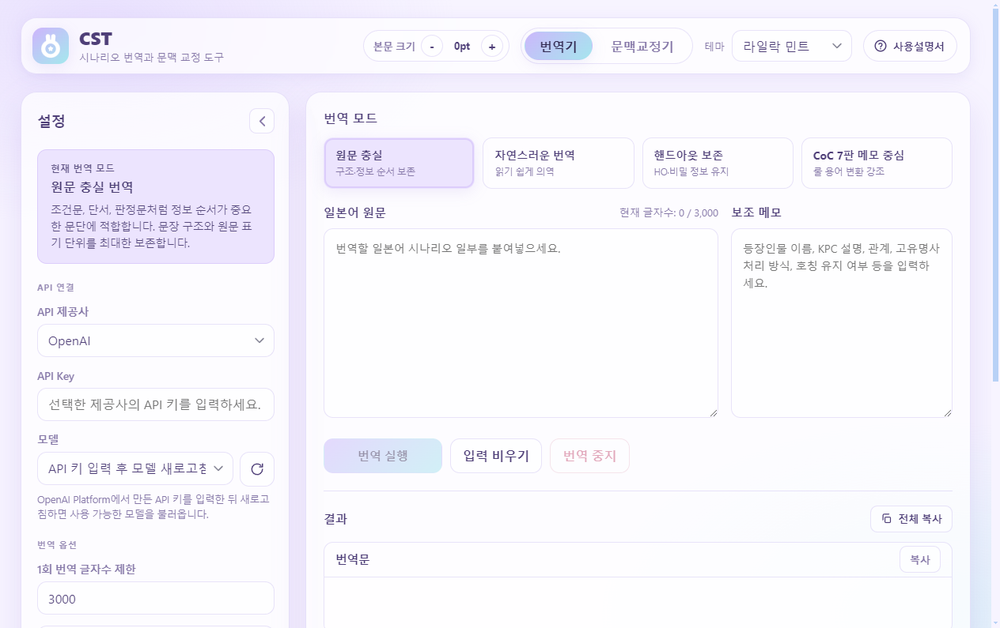
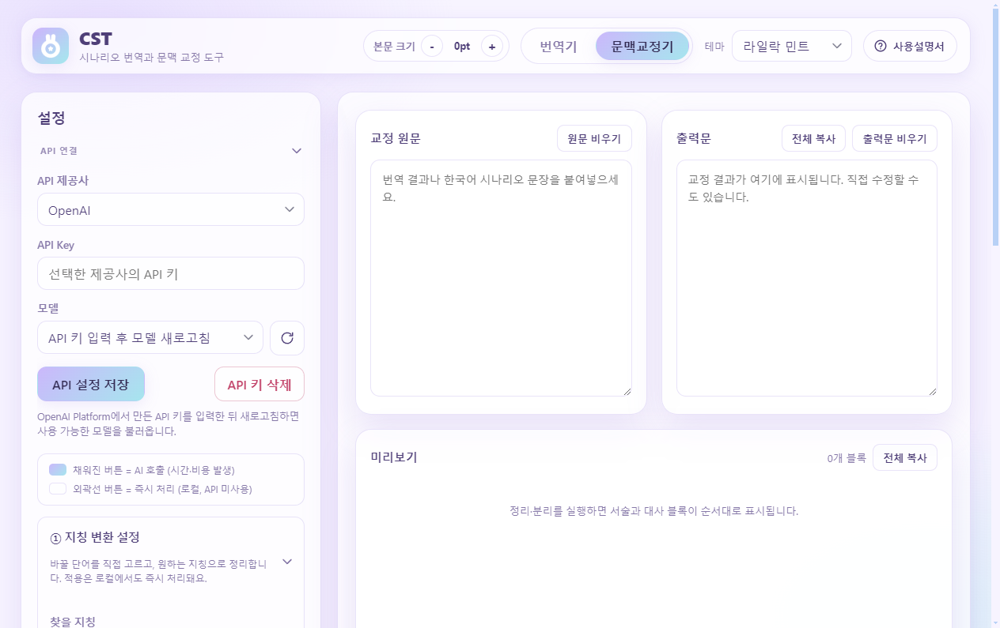

# CST

CST (CoC JP Scenario Translator) is a Windows desktop app for Korean-speaking tabletop RPG players and scenario translators who work with Japanese Call of Cthulhu scenario text.

The app is designed for partial, careful translation work: pasted paragraphs, scene descriptions, handouts, NPC dialogue, judgment text, and context-editing passes. It helps preserve scenario clues, proper nouns, honorifics, TRPG tone, and Call of Cthulhu terminology while keeping the user's API keys and text on their own PC.

## Why This Project Exists

Japanese Call of Cthulhu scenarios are commonly played and translated in the Korean TRPG community, but scenario translation needs more care than general-purpose machine translation. Clues, handouts, hidden information, character speech style, and rule terminology can change the table experience if they are flattened or mistranslated.

CST focuses on that niche workflow:

- Japanese to Korean scenario fragment translation.
- Korean context/prose cleanup for translated or drafted scenario text.
- Separate notes for CoC 7th edition terminology and review-needed items.
- OpenAI or Gemini provider selection using the user's own API key.
- Local-only settings and logs; no server component operated by this project.

The project is small and niche, but it serves a real workflow gap for Korean tabletop RPG maintainers, translators, and keepers who prepare scenarios for play.

## Current Status

The latest public release is still `0.2.1`. The current development branch is preparing `0.2.2`, which focuses on privacy notice wording, local draft controls, provider data-handling clarity, and Electron runtime hardening.

### Latest Public Release

- Version: `0.2.1`
- Release date: `2026-06-02`
- Package type: Windows portable executable
- Download: https://github.com/nanayaD/cst-update/releases/download/v0.2.1/CST-0.2.1-portable.exe
- Release page: https://github.com/nanayaD/cst-update/releases/tag/v0.2.1
- SHA256: `0780934569C710C2CCE23066E5953B43532BF78E686154A05E98FFFD9D382497`

### In Progress For `0.2.2`

- Gemini selection shows a one-time Free Tier data-handling notice.
- OpenAI Responses API requests disable response storage where supported.
- Context editor drafts can be cleared from inside the app.
- Internal prompt examples were replaced with generic sample text.
- User-facing wording now says "provider API request" or "local processing" instead of vague AI wording.
- Electron and electron-builder were updated, with renderer sandboxing and stricter navigation/window/permission handling.

Older release notes are archived under [`docs-archive/release-notes`](docs-archive/release-notes).

## Features

- Translation modes for faithful translation, natural Korean prose, handout-preserving output, and CoC 7e note-focused review.
- Context editor for sentence cleanup, narration/dialogue splitting, narrator-intrusion removal, and reference term replacement.
- PDF text extraction (local, no upload) for text-based horizontal-writing scenario PDFs, with optional ruby/furigana merging into parentheses and Japanese inter-character space cleanup, saved to a UTF-8 `.txt` file.
- Built-in CoC/TRPG terminology data for mythos names, session terms, and sourcebook abbreviations.
- OpenAI and Gemini provider support with model refresh.
- In-app Korean user manual with API key setup guidance.
- Local error logs with API key masking.
- GitHub-hosted update metadata via `latest.json`.

## Screenshots

Screenshots are illustrative and may lag slightly behind the latest development UI.

### Translator



### Context Editor



## Privacy And Security

CST does not run a project server. API requests are sent directly from the user's local app to the selected provider.

- API keys are stored locally in the app settings file on the user's PC.
- Source text and translation results are not uploaded to this repository.
- Context editor drafts are saved locally on the user's PC and can be cleared from the app.
- When Gemini is selected, the app shows a one-time notice that Gemini Free Tier content may be used by Google for product improvement. Users should confirm the provider's current data handling terms before sending private or sensitive text.
- OpenAI API translation requests set response storage off where supported by the Responses API.
- Error logs are local and mask known API key patterns.
- Release builds should never include `.env` files, logs, user settings, or credentials.

See [SECURITY.md](SECURITY.md) for more details.

## Development

```text
npm install
npm run check
npm start
```

Build commands:

```text
npm run build:portable
npm run build:installer
```

Before publishing a release:

1. Run `npm run check`.
2. Build the portable executable only after maintainer approval.
3. Smoke-test the executable.
4. Confirm no credentials, `.env` files, logs, or user data are included.
5. Publish the GitHub Release asset.
6. Update `latest.json` only after the matching release asset exists.

## Update Metadata

The app reads update metadata from:

```text
https://raw.githubusercontent.com/nanayaD/cst-update/main/latest.json
```

`latest.json` should contain only public release information:

- `version`: released app version.
- `releaseDate`: release date in `YYYY-MM-DD` format.
- `downloadUrl`: direct release asset URL, or a release page URL.
- `packageType`: `portable` or `installer`.
- `required`: `true` only for urgent updates.
- `notes`: short Korean release notes suitable for users.

## Korean Summary

CST는 일본어 Call of Cthulhu 시나리오 일부를 한국어로 번역하고 문맥을 다듬는 Windows용 보조 도구입니다. 일반 문서 전체 번역기가 아니라, 시나리오 준비 중 필요한 문단, 장면 묘사, NPC 대사, 핸드아웃, 판정문 등을 붙여넣어 사용할 수 있도록 만들었습니다.

API 키와 설정은 사용자 PC에 저장되며, 이 프로젝트가 별도 서버를 운영하거나 사용자의 시나리오 원문을 저장하지 않습니다.

## License

This project is released under the MIT License. See [LICENSE](LICENSE).
